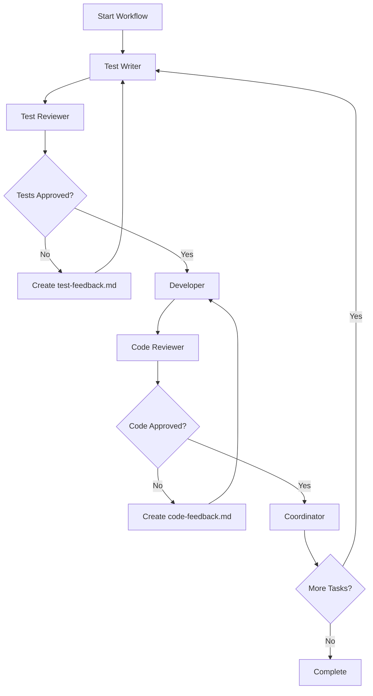

# Claude App Builder - System Architecture

## Overview
An automated application development system that uses Claude Code CLI to build software through Test-Driven Development (TDD). The system orchestrates multiple Claude instances with different roles to ensure high-quality code output.

## Core Components

### 1. Orchestration Layer
- **File**: `automated-workflow.sh`
- **Purpose**: Main automation engine that coordinates all Claude instances
- **Responsibilities**:
  - Execute workflow phases in sequence
  - Handle role transitions and feedback loops
  - Manage error handling and retries
  - Monitor workflow completion

### 2. Role Management System
Five distinct Claude roles that work together:

#### Test Writer
- **Purpose**: Create comprehensive test suites
- **Input**: Requirements from todo.md, context from memory.md
- **Output**: Unit, integration, and e2e test files
- **Constraint**: Tests must fail without implementation

#### Test Reviewer
- **Purpose**: Validate test quality and coverage
- **Input**: Test files created by Test Writer
- **Output**: Approval or feedback file (test-feedback.md)
- **Validation**: Runs tests to ensure they fail correctly

#### Developer
- **Purpose**: Implement code to pass tests
- **Input**: Approved test files
- **Output**: Implementation files
- **Constraint**: Minimal code only, no extra features

#### Code Reviewer
- **Purpose**: Validate implementation quality
- **Input**: Implementation files and test files
- **Output**: Approval or feedback file (code-feedback.md)
- **Validation**: Runs all tests to ensure they pass

#### Coordinator
- **Purpose**: Manage workflow progress and documentation
- **Input**: Completed work from previous roles
- **Output**: Updated todo.md and memory.md
- **Decision**: Determines next task or workflow completion

### 3. Communication Layer
File-based communication between roles:

#### Core Files
- **todo.md**: Task definitions and priorities
- **memory.md**: System knowledge and decisions
- **CLAUDE.md**: Role instructions and workflows

#### Feedback Files
- **test-feedback.md**: Test improvement requirements
- **code-feedback.md**: Code improvement requirements
- **workflow-complete.flag**: Completion signal

### 4. Quality Assurance
Built-in quality gates:

#### Feedback Loops
- Test Writer ↔ Test Reviewer
- Developer ↔ Code Reviewer

#### Safety Mechanisms
- Maximum iteration limit (20)
- Exit codes for error handling
- Automatic cleanup of feedback files

## Workflow Process



## File Structure

```
claude-app-builder/                    # Root system directory
├── Core System Files
│   ├── automated-workflow.sh          # Main orchestration script
│   ├── CLAUDE.md                      # System instructions
│   ├── ARCHITECTURE.md                # This file
│   └── README.md                      # User documentation
├── Project Management
│   ├── todo.md                        # Task definitions
│   ├── memory.md                      # System knowledge
│   └── workflow.md                    # Detailed workflow docs
├── dashboard/                         # Generated dashboard project
│   ├── package.json                   # Dashboard dependencies
│   ├── tsconfig.json                  # TypeScript config
│   ├── vite.config.ts                 # Build configuration
│   ├── index.html                     # Entry point
│   ├── src/                           # Dashboard source code
│   │   ├── components/                # React components
│   │   ├── pages/                     # Page components
│   │   ├── hooks/                     # Custom hooks
│   │   ├── services/                  # API services
│   │   ├── types/                     # TypeScript definitions
│   │   ├── utils/                     # Utilities
│   │   ├── App.tsx                    # Main app component
│   │   └── main.tsx                   # Entry point
│   ├── public/                        # Static assets
│   └── tests/                         # Dashboard tests
└── Temporary Files
    ├── test-feedback.md               # Test review feedback
    ├── code-feedback.md               # Code review feedback
    └── workflow-complete.flag         # Completion signal
```

## Project Structure Rules

1. **System files stay in root** - Never mix system files with generated code
2. **Each project gets its own directory** - dashboard/, api/, cli/, etc.
3. **Tests go with the project** - Not in root level
4. **Proper separation** - Clear boundaries between system and projects

## Technical Implementation

### Claude Code CLI Integration
```bash
echo "$prompt" | claude --print \
    --dangerously-skip-permissions \
    --allowedTools "Bash,Edit,Write,Read,Grep,Glob,LS,MultiEdit,..."
```

### Role System Design
Each role has:
- **System Prompt**: Defines role behavior and constraints
- **User Prompt**: Specific task instructions
- **Tool Access**: Permitted Claude Code tools
- **Output Requirements**: Expected deliverables

### Error Handling
- Exit code monitoring
- Feedback file detection
- Automatic retry mechanisms
- Maximum iteration safety limits

## Extension Points

### New Roles
Add new roles by:
1. Defining system prompt
2. Adding to workflow loop
3. Implementing feedback mechanism

### New Project Types
Support new project types by:
1. Adding templates to todo.md
2. Updating memory.md with conventions
3. No code changes required

### Custom Tools
Extend tool access by:
1. Adding to `--allowedTools` list
2. Updating role permissions
3. Testing with new capabilities

## Benefits

### For Developers
- **Zero Setup**: Just define requirements in todo.md
- **Quality Assurance**: Multiple review stages
- **Learning**: See best practices in generated code
- **Productivity**: Focus on requirements, not implementation

### For Projects
- **Test Coverage**: 100% test coverage guaranteed
- **Code Quality**: Multiple review stages
- **Consistency**: Follows established patterns
- **Documentation**: Automatic progress tracking

### For Teams
- **Standardization**: Consistent development approach
- **Knowledge Sharing**: Documented decisions in memory.md
- **Onboarding**: Clear workflow and role definitions
- **Scalability**: Add new team members easily

## Current Status
- ✅ Core workflow engine implemented
- ✅ All five roles defined and tested
- ✅ Quality assurance mechanisms in place
- ✅ File-based communication system working
- ✅ Tested with React/TypeScript dashboard project
- ✅ **FREE embedding system implemented** - Zero ongoing costs
- ✅ **Enterprise vector database** - Production-ready memory system
- 🎯 Ready for production use with $0 operating costs